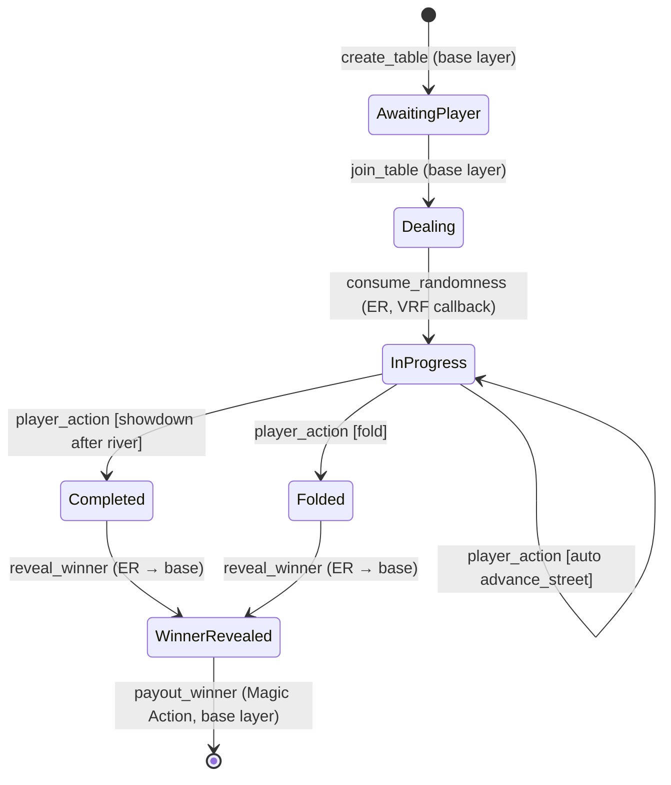

# Poker Game Program — Implementation Plan

> All design decisions resolved via grill-with-docs session. No open questions remain.

---

## Decision Summary

| # | Decision | Rationale |
|---|---|---|
| 1 | Separate Anchor program (`programs/poker/`) | Avoids touching existing battleship code; no multi-game abstractions needed |
| 2 | Heads-up No-Limit Texas Hold'em | Matches 2-player pattern; state accounts use `Vec<Pubkey>` for future N-player |
| 3 | MagicBlock VRF for card shuffle | Provably fair, purpose-built for ER, single async step |
| 4 | Single VRF call + `DealerDeck` PDA | One async pause; community cards copied progressively from private DealerDeck |
| 5 | 1 lamport = 1 chip | No conversion math; matches Vault deposit pattern |
| 6 | Single hand per session | Mirrors battleship lifecycle; create → play → settle → done |
| 7 | Creator-set blinds with validation | `bb == 2 * sb`, `bb <= buy_in / 5`; flexible per-table |
| 8 | Auto street advancement in `player_action` | No intermediate states; fewer transactions |
| 9 | Payout via Magic Actions | `reveal_winner` schedules `payout_winner` as post-commit base-layer action |
| 10 | Single test file, devnet-focused | `tests/poker.test.ts`; PER requires TEE validators (devnet only) |
| 11 | Terminology: `PokerTable`, `PlayerHand`, `DealerDeck` | Clean domain language distinct from battleship |

---

## Proposed Changes

### Poker Program (`programs/poker/`)

All files below are **NEW**. No existing files are modified except `Anchor.toml` (new program entry) and `CONTEXT.md` (glossary update).

---

#### [NEW] [Cargo.toml](file:///home/nitishc/progmag/cayed/programs/poker/Cargo.toml)

```toml
[package]
name = "poker"
version = "0.1.0"
edition = "2021"

[lib]
crate-type = ["cdylib", "lib"]
name = "poker"

[features]
default = []
cpi = ["no-entrypoint"]
no-entrypoint = []
no-idl = []
no-log-ix-name = []
idl-build = ["anchor-lang/idl-build"]

[dependencies]
anchor-lang = { version = "0.32.1", features = ["init-if-needed"] }
ephemeral-rollups-sdk = { version = "0.8.0", features = ["anchor", "access-control"] }
ephemeral-vrf-sdk = { version = "0.2.1", features = ["anchor"] }
```

---

#### [NEW] [src/lib.rs](file:///home/nitishc/progmag/cayed/programs/poker/src/lib.rs)

Program entry with `#[ephemeral]` + `#[program]`. Instructions:

| Instruction | Runs on | Purpose |
|---|---|---|
| `init_poker_config` | Base | Initialize poker-specific protocol params |
| `create_table` | Base | P1 creates table + deposits buy-in |
| `join_table` | Base | P2 joins + deposits buy-in |
| `deal_cards` | ER | Request VRF randomness |
| `consume_randomness` | ER | VRF callback → shuffle deck, deal hole cards, store community in DealerDeck |
| `player_action` | ER | Fold/Check/Call/Raise/AllIn; auto-advances streets and triggers showdown |
| `reveal_winner` | ER | Commit + undelegate + clear permissions + schedule payout via Magic Action |
| `payout_winner` | Base | `#[action]` target — CPI transfer from Vault to winner |
| `create_permission` | Base | ER access control (same pattern as battleship) |
| `delegate_pda` | Base | Delegate accounts to ER |

---

#### [NEW] [src/errors.rs](file:///home/nitishc/progmag/cayed/programs/poker/src/errors.rs)

```rust
#[error_code]
pub enum PokerError {
    #[msg("Number overflowed")]
    Overflow,

    // Config
    #[msg("Not authorized to perform this action")]
    Unauthorized,

    // Create Table
    #[msg("Buy-in was supplied but below minimum")]
    MinimumBuyIn,
    #[msg("Big blind must equal 2x small blind")]
    InvalidBlindRatio,
    #[msg("Big blind must be at most buy_in / 5")]
    BlindsTooLarge,

    // Join Table
    #[msg("Cannot join a table created by yourself")]
    CannotJoinSelf,
    #[msg("The table is already full")]
    TableFull,

    // Dealing
    #[msg("Cards have already been dealt")]
    CardsAlreadyDealt,
    #[msg("Table is not in the correct state for this action")]
    InvalidTableStatus,

    // Actions
    #[msg("It is not your turn to act")]
    InvalidTurn,
    #[msg("Invalid action for the current game state")]
    InvalidAction,
    #[msg("Insufficient chips for this action")]
    InsufficientChips,
    #[msg("Raise amount is below the minimum")]
    RaiseTooSmall,
    #[msg("Game has not started yet")]
    GameNotStarted,
    #[msg("Player has already folded")]
    AlreadyFolded,
    #[msg("Cannot check when there is a bet to match")]
    CannotCheck,

    // Showdown / Reveal
    #[msg("Betting round is not complete")]
    BettingNotComplete,
    #[msg("Game is not completed yet")]
    GameNotCompleted,
}
```

---

#### [NEW] State Accounts

##### `PokerConfig` — PDA `["poker_config"]`

```rust
pub struct PokerConfig {
    pub authority: Pubkey,
    pub vault: Pubkey,
    pub fee: u16,        // basis points (10000 = 100%)
    pub min_buy_in: u64, // lamports
    pub bump: u8,
}
```

##### `PokerVault` — PDA `["poker_vault"]`

```rust
pub struct PokerVault {
    pub authority: Pubkey,
    pub bump: u8,
}
```

##### `PokerTable` — PDA `["poker_table", id.to_le_bytes()]`

Public game state. Delegated to ER during gameplay.

```rust
pub struct PokerTable {
    pub id: u64,
    pub max_players: u8,                  // 2 for heads-up, future: up to 9
    pub players: Vec<Pubkey>,             // Vec for future N-player support
    pub buy_in: u64,                      // lamports
    pub small_blind: u64,                 // lamports
    pub big_blind: u64,                   // lamports
    pub pot: u64,                         // total chips in pot
    pub current_bet: u64,                 // current bet to match this round
    pub min_raise: u64,                   // minimum raise amount
    pub community_cards: [u8; 5],         // card indices (0-51), revealed progressively
    pub community_revealed: u8,           // 0 → 3 (flop) → 4 (turn) → 5 (river)
    pub street: Street,
    pub status: PokerTableStatus,
    pub dealer_index: u8,                 // index into players vec (0 or 1 for heads-up)
    pub player_chips: Vec<u64>,           // chip stack per player
    pub player_bets: Vec<u64>,            // current round bet per player
    pub player_acted: Vec<bool>,          // has player acted this round
    pub player_folded: Vec<bool>,         // has player folded
    pub next_to_act: u8,                  // index into players vec
    pub deck_seed: [u8; 32],              // VRF randomness
    pub bump: u8,
}
```

##### `PlayerHand` — PDA `["poker_hand", game_id.to_le_bytes(), player_pubkey]`

Private per-player state. Delegated to ER with PER (only owning player can read via RPC).

```rust
pub struct PlayerHand {
    pub game_id: u64,
    pub player: Pubkey,
    pub cards: [u8; 2],       // hole card indices (0-51)
    pub bump: u8,
}
```

##### `DealerDeck` — PDA `["dealer_deck", game_id.to_le_bytes()]`

Private deck state. Delegated to ER with PER (no members — nobody can read via RPC).

```rust
pub struct DealerDeck {
    pub game_id: u64,
    pub community_cards: [u8; 5],  // pre-dealt community cards
    pub bump: u8,
}
```

##### Enums

```rust
pub enum Street { PreFlop, Flop, Turn, River, Showdown }

pub enum PokerTableStatus {
    AwaitingPlayer,
    Dealing,                        // waiting for VRF callback
    InProgress,
    Completed { winner: Pubkey },   // showdown determined winner
    Folded { winner: Pubkey },      // opponent folded
    WinnerRevealed { winner: Pubkey },
}

pub enum PlayerAction {
    Fold,
    Check,
    Call,
    Raise { amount: u64 },
    AllIn,
}

pub enum PokerAccountType {
    Table { game_id: u64 },
    PlayerHand { game_id: u64, player: Pubkey },
    DealerDeck { game_id: u64 },
}
```

---

#### Card Encoding & Hand Evaluation

##### [NEW] `src/state/deck.rs`

- **52 cards** as `u8` (0–51): `suit = card / 13`, `rank = card % 13` (2=0, 3=1, …, A=12)
- **Fisher-Yates shuffle** using VRF-provided 32 bytes as PRNG seed
- Deterministic: same seed → same shuffle → same deal
- From shuffled deck: `[0..1]` = P1 hole cards, `[2..3]` = P2 hole cards, `[4..8]` = community cards

##### [NEW] `src/state/hand_eval.rs`

- Evaluate best 5-card hand from 7 cards (2 hole + 5 community)
- C(7,5) = 21 combinations checked
- Returns `u32` score: higher = better hand
- Ranking bits: `[hand_type (4 bits)][primary (4 bits)][secondary (4 bits)][kickers (16 bits)]`
- Hand types: Royal Flush(9) > Straight Flush(8) > Quads(7) > Full House(6) > Flush(5) > Straight(4) > Trips(3) > Two Pair(2) > Pair(1) > High Card(0)
- Ties broken by score comparison (kicker encoding)

---

#### Instruction Flow



**Heads-up betting rules:**
- **Pre-flop**: Dealer = small blind, non-dealer = big blind. Dealer acts first.
- **Post-flop** (flop/turn/river): Non-dealer acts first.
- Street complete when: both acted AND bets matched (or one player all-in).
- `player_action` auto-copies community cards from `DealerDeck` → `PokerTable` when advancing.

---

#### Magic Actions Payout

`reveal_winner` (ER) schedules `payout_winner` (base layer) via:

```rust
// In reveal_winner:
let payout_ix_data = InstructionData::data(&instruction::PayoutWinner {});
let action = CallHandler {
    destination_program: crate::ID,
    accounts: vec![
        ShortAccountMeta { pubkey: poker_table.key(), is_writable: false },
        ShortAccountMeta { pubkey: vault.key(), is_writable: true },
        ShortAccountMeta { pubkey: winner.key(), is_writable: true },
        ShortAccountMeta { pubkey: config.key(), is_writable: false },
        ShortAccountMeta { pubkey: system_program.key(), is_writable: false },
    ],
    args: ActionArgs::new(payout_ix_data),
    escrow_authority: payer.to_account_info(),
    compute_units: 200_000,
};

MagicIntentBundleBuilder::new(payer, magic_context, magic_program)
    .commit_and_undelegate(&[table, p1_hand, p2_hand, dealer_deck])
    .add_post_commit_actions([action])
    .build_and_invoke()?;
```

`payout_winner` (base-layer `#[action]` instruction):
```rust
let total_pot = table.buy_in * 2;
let fee = (total_pot * config.fee as u64) / 10_000;
let payout = total_pot - fee;
// CPI: Vault → winner (payout), signed by Vault PDA seeds
// CPI: Vault → authority (fee), if fee > 0
```

---

### Tests

#### [NEW] [tests/poker.test.ts](file:///home/nitishc/progmag/cayed/tests/poker.test.ts)

Devnet-targeted test suite using same infrastructure as `cayed.test.ts`:
- `@coral-xyz/anchor` + `@solana/web3.js`
- Auth tokens for PER via `getAuthToken`
- `sendAndConfirmER` helper with retry logic

| Group | Test | Validates |
|---|---|---|
| **Config** | `inits poker config` | PokerConfig PDA created |
| | `rejects re-init by different authority` | Unauthorized error |
| **Create Table** | `creates table with permission + delegate` | PokerTable + PlayerHand + DealerDeck created, status=AwaitingPlayer |
| | `rejects buy-in below minimum` | MinimumBuyIn error |
| | `rejects invalid blind ratio` | InvalidBlindRatio error |
| | `rejects blinds too large` | BlindsTooLarge error |
| **Join Table** | `joins table + permission + delegate` | Status→Dealing, player added |
| | `rejects self-join` | CannotJoinSelf error |
| | `rejects 3rd player` | TableFull error |
| **Deal** | `requests and receives VRF randomness` | deck_seed set, cards dealt, status→InProgress |
| **Privacy** | `player sees own hand but not opponent` | PER read isolation |
| | `nobody can read dealer deck` | DealerDeck PER isolation |
| **Actions** | `rejects wrong turn` | InvalidTurn error |
| | `player folds → opponent wins` | Status→Folded, correct winner |
| | `check-check advances to flop` | 3 community cards revealed |
| | `raise → call flow` | Bets matched, pot updated |
| | `rejects raise below minimum` | RaiseTooSmall error |
| | `rejects check when bet exists` | CannotCheck error |
| | `all-in and call` | All chips committed, auto-run-out |
| **Full Hand** | `plays complete hand to showdown` | All streets, evaluation, winner |
| **Reveal** | `reveals winner + pays out via Magic Action` | State on base layer, winner balance increased |

---

### Config File Changes

#### [MODIFY] [Anchor.toml](file:///home/nitishc/progmag/cayed/Anchor.toml)

```diff
 [programs.devnet]
 cayed = "6xLHbAHw2ibrmdVEPHm7jDkDmghw3fp3gUCBy511DMKV"
+poker = "<GENERATED_PROGRAM_ID>"
```

> [!NOTE]
> `Cargo.toml` workspace uses `members = ["programs/*"]` glob — no change needed; `programs/poker/` is auto-included.

#### [MODIFY] [CONTEXT.md](file:///home/nitishc/progmag/cayed/CONTEXT.md)

Add poker domain terms to glossary. Update preamble to note the one-program-per-game experiment.

---

## Verification Plan

### Automated Tests
1. `anchor build` — both programs compile
2. `anchor deploy --provider.cluster devnet` — poker program deployed
3. `bun test --timeout 1000000 tests/poker.test.ts` — all poker tests pass against devnet
4. `bun test --timeout 1000000 tests/cayed.test.ts` — battleship tests still pass (regression check)

### Manual Verification
- Inspect IDL: `target/idl/poker.json`
- Verify PER isolation: player can read own hand, cannot read opponent hand or dealer deck
- Verify payout: winner's SOL balance increases by (buy_in * 2 - fee) after reveal

---

## File Summary

| Action | Path | Purpose |
|---|---|---|
| NEW | `programs/poker/Cargo.toml` | Rust package config |
| NEW | `programs/poker/src/lib.rs` | Program entry + instruction dispatch |
| NEW | `programs/poker/src/errors.rs` | Error codes |
| NEW | `programs/poker/src/state/mod.rs` | State module exports |
| NEW | `programs/poker/src/state/config.rs` | PokerConfig |
| NEW | `programs/poker/src/state/vault.rs` | PokerVault |
| NEW | `programs/poker/src/state/table.rs` | PokerTable + enums |
| NEW | `programs/poker/src/state/player_hand.rs` | PlayerHand (private) |
| NEW | `programs/poker/src/state/dealer_deck.rs` | DealerDeck (private) |
| NEW | `programs/poker/src/state/mb_helpers.rs` | PokerAccountType + PDA seed helpers |
| NEW | `programs/poker/src/state/hand_eval.rs` | On-chain hand evaluator |
| NEW | `programs/poker/src/state/deck.rs` | Fisher-Yates shuffle from VRF seed |
| NEW | `programs/poker/src/instructions/mod.rs` | Instruction module exports |
| NEW | `programs/poker/src/instructions/init_poker_config.rs` | Config init |
| NEW | `programs/poker/src/instructions/create_table.rs` | Create table + buy-in deposit |
| NEW | `programs/poker/src/instructions/join_table.rs` | Join table + buy-in deposit |
| NEW | `programs/poker/src/instructions/deal_cards.rs` | Request VRF |
| NEW | `programs/poker/src/instructions/consume_randomness.rs` | VRF callback → shuffle + deal |
| NEW | `programs/poker/src/instructions/player_action.rs` | Fold/Check/Call/Raise/AllIn + auto-advance |
| NEW | `programs/poker/src/instructions/reveal_winner.rs` | Commit + undelegate + Magic Action payout |
| NEW | `programs/poker/src/instructions/payout_winner.rs` | `#[action]` base-layer CPI payout |
| NEW | `programs/poker/src/instructions/create_permission.rs` | ER access control |
| NEW | `programs/poker/src/instructions/delegate_pda.rs` | ER delegation |
| NEW | `tests/poker.test.ts` | Full E2E test suite (devnet) |
| MODIFY | `Anchor.toml` | Add poker program entry |
| MODIFY | `CONTEXT.md` | Add poker glossary terms |
